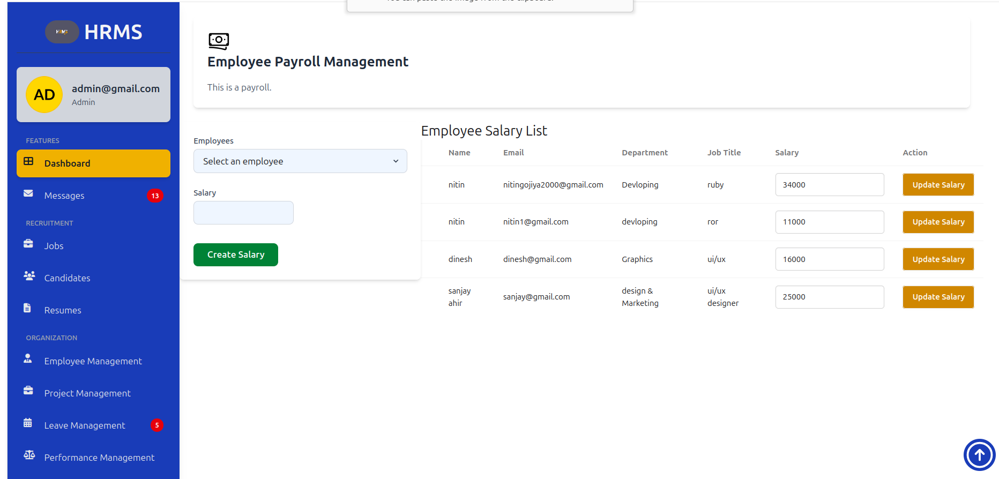

# README


Welcome to the **HRMS (Human Resource Management System)** project!

This document provides all the necessary steps to get the application up and running, including requirements, setup, configuration, and usage instructions.


## Requirements

- **Ruby version:** `3.4.2`
- **System dependencies:** [`tailwindcss-ruby`](https://github.com/rails/tailwindcss-rails)

## Setup & Configuration

1. **Install dependencies:**
   ```bash
   bundle install
   ```

2. **Set up the database:**
   ```bash
   rails db:setup
   # or, if you want to seed existing database
   rails db:seed
   ```

3. **Configuration:**
   - Copy and edit any required files in `config/` as needed (e.g., `database.yml`, `credentials.yml.enc`).

## Running the Application

Start the Rails server:
```bash
bin/rails server
```

## Running Tests

To run the test suite:
```bash
bin/rails test
```

## Services

- **Job queues:** See `config/queue.yml` for configuration.
- **Cache server:** See `config/cache.yml`.
- **Search engines:** (Add details if used)

## Deployment

Refer to `config/deploy.yml` and your deployment platform documentation for instructions.

* ...

* Employee Home Page

* Admin Home Page

* Admin payroll

* Admin Leave Manage

